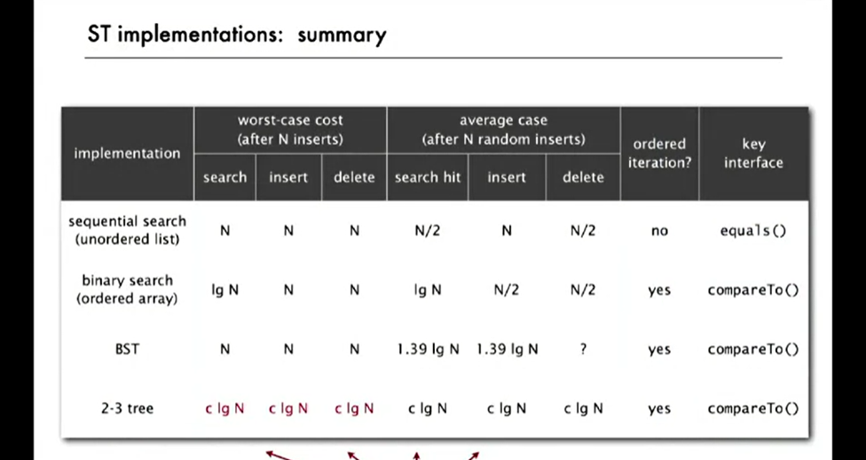

Allow 1 or 2 keys per node

2-node: one key, two children
3-node: two keys, three children

Worst Case: lgN

Best Case: log3N

Between 12 and 20 for a million nodes.

Between 18 and 30 for a billion nodes.

