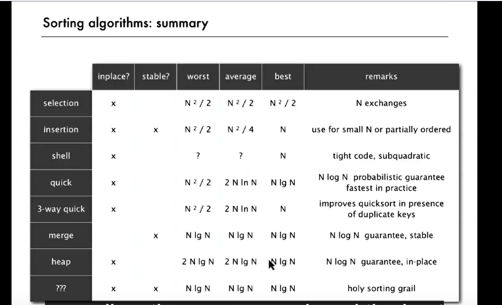

# Basic plan for in-place sort

* create max-heap with all N keys

* Repeatedly remove the maximum key

Heap construction. Build max heap using bottom-up method

Sortdown Repeatedly delete the largest remaining item

because delete the largeest means move it to the end the array(but not set to null)

firstpass: build heap using bottom-up method

```java
for (int k = N / 2; k > = 1; k--) {
    sink(a, k, N);
}

public static void sort(Comparable[] pq) {
    int N = pq.length;
    for (int k = N/2; k >= 1; k--) sink(pq, k ,N);
    while (N > 1) {
        exch(pq, 1, N);
        sink(pq, 1, --N);
    }
}
```

Proposition: Heap construction uses <= 2N compares and exchanges

Proposition: HeapSort uses <= 2NlgN compares and exchanges




