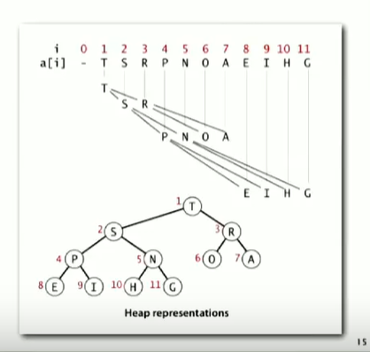

Collection. Insert and delete items. Which item to delete

Stack Remove the item most recently added.

Queue Remove the item least recently added.

Randomized queue Remove a random item.

Priority queue Remove the largest (samllest) item.

```java
public class MaxPQ<Key extends Comparable<Key>> {
    MaxPQ();
    MAXPQ(Key[] a);
    void insert(Key v);
    Key delMax()
    boolean isEmpty()
    Key max()
    int size()
}
```

BinaryTree: Empty or node with links to left and right binary trees

Complete tree: Perfectly balanced,except for bottom level

Property Height of complete tree with N nodes is $\lfloor{} lgN\rfloor{}$

# Binary heap

Array representation of a heap-ordered binary tree

Heap-ordered binary tree

* key in nodes

* parent's key no smaller than children's keys

Array representations

* indices start at 1

* Take nodes in level order

* No explicit link needed



Proposition: Largest key is a[1], which is root of binary tree

Proposition Can use array indices to move through tree

* Parent of node at k is k / 2

* Children of node at k are 2k and 2k + 1

## scenario

children's key becomes larger key than its's parent's key

To eliminate the violation:

exchange the key in the child with the key in parent. Repeat until heap order restored

```java
private void swim(int k) {
    while (k > 1 && less(k / 2, k)) {
        exch(l , k / 2);
        k = k / 2;
    }
}
```

insert add note at end, then swim it up

At most 1 + lgN compares

```java
public void insert(Key x) { 
    pq[++N] = x;
    swim(N);
}
```
Parent key becomes smaller than one or both of its children's

Exchange key in parent with key in larger child

Repeat until heap order restored

```java
private void sink(int k) {
    while (2 * k <= N) {
        int j = 2 * k;
        if (j < N && less(j, j + 1)) j++;
        if (!less(k, j)) break;
        exch(k, j);
        k = j;
    }
}
```

```java
public key delMax() {
    Key max = pq[1];
    exch(1, N--);
    sink(1);
    pq[N+1] = null;
    return max;
}
```